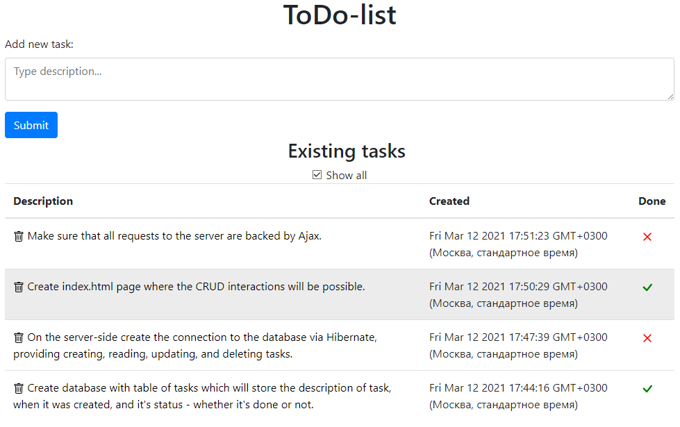
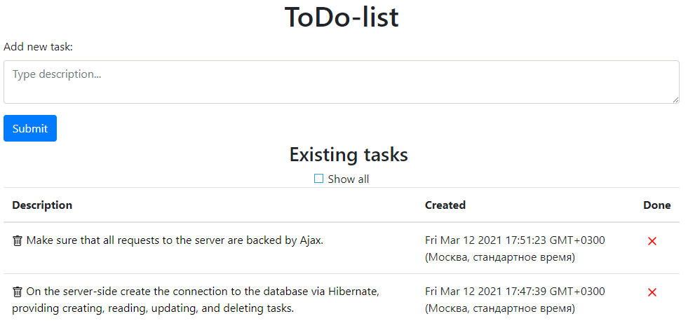
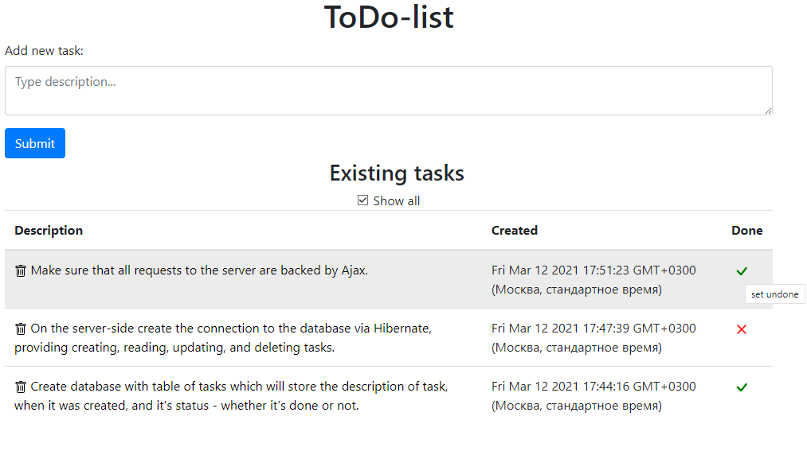
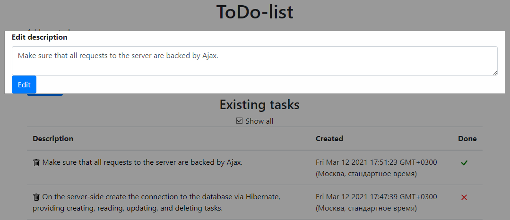

#TODO list

This is simple todo-list web-app. You can submit a task typing the text into textarea and pushing the submit button.
All tasks are ordered in the descending order by creation date.

Tick the "Show All" checkbox to hide or show the done tasks.

Click the cross to set the task done and visa versa.

Click the task to change it. All changes to the tasks go to the database.

