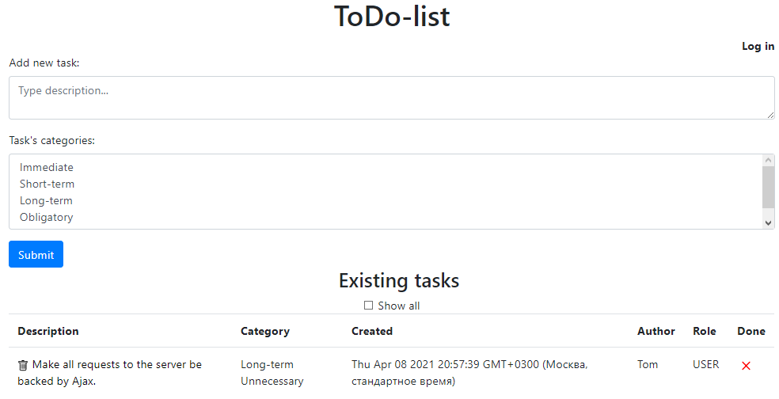

# TO-DO list

This is a simple to-do list web-app. Once you have logged in you can submit a task typing the description into the textarea,
choosing one or more categories for the task, and pushing the submit button.
All tasks are ordered in the descending order by creation date.

If you do not have an account yet, you can create one by pushing "register" button in the "Log in" form. 
Enter your name, email, password, and choose your role.
You can type any new role if you want.

Tick the "Show All" checkbox to hide or show the done tasks.

Once you have logged in or registered you are allowed to create, update, or delete an item.

Click the cross to set the task done and visa versa.

Click the task to change it. All changes to the tasks go to the database. 

Note that if a task becomes updated either by changing its done status or by typing another description, 
the task's author also changes to the latest one who updated it.

